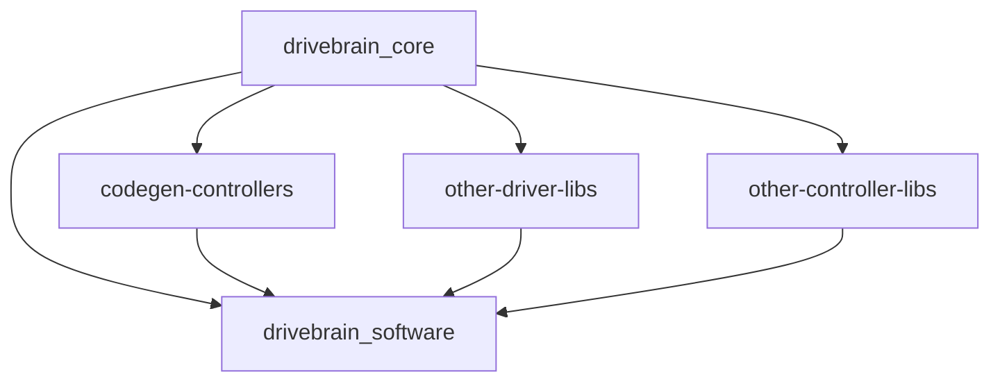

# About

This repo contains the main executable that runs on the Drivebrain embedded computer on HyTech Racing's cars. This code is deployed as a `systemd` service onto the car within HyTech's [raspberry pi nixos description](https://github.com/hytech-racing/hytech_nixos). This service handles, among other things:

- high-performance control algorithm execution from both hand written c++ and MATLAB Simulink generated code c++
- car state estimation via both hand written c++ and MATLAB Simulink generated code c++
- Vectornav INS communication via Vectornav's driver
- live telemetry and data recording of all on-car inter-board communications (CAN and Ethernet mostly)
- car-level parameter servicing of all previously listed components via the integrated Foxglove websocket server

## links to resources for more about this software

- [`drivebrain_software` release planning and changelog](https://wiki.hytechracing.org/books/software/page/drivebrain-software-release-planning-and-changelog)
- [software architecture design](https://wiki.hytechracing.org/books/software/page/drivebrain-architecture)
- [drivebrain docs](https://wiki.hytechracing.org/books/software/page/drivebrain-documentation)

## repo and library structure

as can be seen in the `flake.nix` file, there are upstream repos that this software depends upon, most of them are not written by us directly and some of them are auto-generated (such as the controller/estimator library and CAN library)

chief among the upstream repo libraries is the `drivebrain_core` repo which contains code that is common to both `drivebrain_software` and other upstream libraries that `drivebrain_software` depends upon, such as controller, estimator and driver lib implementations. 



__NOTE:__ The other driver / controller libraries are hypothetical right now, however these will be realized in future development as we continue development of drivebrain software.

## core ideas and themes

The main idea behind this service is we needed a way to integrate generated controllers and we wanted to preserve the utility of our previously dedicated [`data_acq`](https://github.com/hytech-racing/data_acq) service that handled live telem and recording of CAN data. For this, we still wanted to maintain automated generation of parsing code for the new interfaces used elswhere on the car but only monitored by the drivebrain, taking the place of the Telemetry Control Unit (TCU).

In general, we are trying to not write any repetitive code for handling parsing / encoding or data shuffling between data types and have that code be either generated by us or another well understood tool such as Protobuf. We also want to have our important code run as fast as possible and everything is in support of our controller code.

## quickstart

### native platform nix build:
`nix build`

### development building
```nix develop```

```build```

### cross-compile natively (if on x86)
`nix build .#legacyPackages.x86_64-linux.pkgsCross.aarch64-multiplatform.drivebrain_software`

## first pass
ideas:
- at first, we will generate protobuf message descriptions from the simulink model
- we will do handle manual integration for any new inputs / outputs

questions:
1. do we want to separate the state estimation and the controllers?
    - I think so since we can iterate on controllers faster than state estimation and switch between them using the same plugin/library defined state estimation systems.

2. does it really make sense to have the state estimation be separated from the controller when they are both developed in simulink?
    - maybe...?
    - how will we handle having both the state estimation and the controller in simulink lap sim AND having to have wrapper code for when it becomes a separate lib integration?

I think for q2, we can go with keeping the state estimation monolithic? 

- keep CASE, just new wrapper code for v1? 

### resources / libs to use

for CAN parsing: https://github.com/xR3b0rn/dbcppp

## what we want from the drivebrain driver bus

how much do we want to tie in protobuf?
    - do we want each driver to have to deal with protobufs or do we want them to output something else?
        - we need a way to unify each driver's output to the driver bus 
            - I think it would be fine to have each driver be able to define their own protobuf message for output
                - we cant have a single message type that we compose from the driver messages
                - we will need some sort of registration for each message type
            - each driver can act as an adapter to protobuf messages
            - do we want to be able to have N messages be returned from each driver? or does each driver have to only output one message?
                - we still want to be able to have a single message per topic in foxglove / mcap
                - we can have named channels in each driver 
                - protobuf introspection for the data acq

what about a json based message struct generator for setting what each driver can output?
    - we can generate the json with matlab too and so we can hook into the code gen 
    - we can generate protos and adapter code between the struct and the resulting protobuf message to 
output requirements:
- needs to be composed directly from drivers it is composed of
    - the drivers being used are known at compile time
- parameter interface
    - the drivers have to a parameter update function that can be used outside of initialization

## development

`nix develop` enters you into the devshell for building with cmake

example `c_cpp_properties.json` file to be placed in your `.vscode/`:
```json
{
    "configurations": [
        {
            "name": "dev",
            "includePath": [
                "${workspaceFolder}/**"
            ],
            "defines": [],
            "compileCommands": "${workspaceFolder}/build/compile_commands.json"
        }
    ],
    "version": 4
}
```